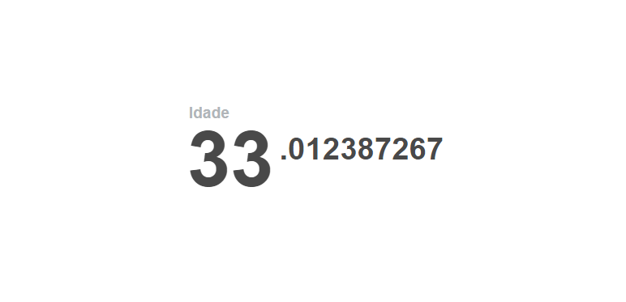

Motivação
========

# Motivação no seu Google Chrome
### Quanto tempo você já viveu? Esse tempo foi bem utilizado?

>   o seu foco determina a sua realidade

Pensando nessas perguntas lancei uma extensão para o Google Chrome com o nome de Motivação.

A extensão é bem simples, a cada nova aba que você abre no Chrome é mostrado quanto tempo você já viveu, o que leva a cogitar se a página que você “quer abrir” é realmente útil e se estará utilizando bem o seu tempo.

Pensar nisso tem me ajudado a usar melhor o meu tempo, espero te ajudar também.

Para instalar a extensão, clique aqui. Na primeira vez que usar basta informar o dia, mês e ano que você nasceu.

P.S.: Essa extensão é uma cópia de Motivation, criado por Alex Maccaw

